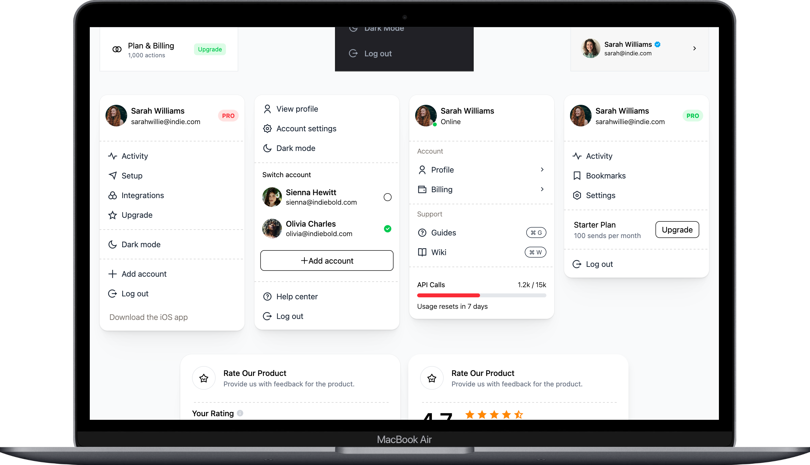

# Beautiful UI Blocks, Crafted with Tailwind CSS for Vue.js

A collection of prebuilt Vue.js components styled with Tailwind CSS to help you quickly design and develop beautiful user interfaces. 

### Live demo (https://indiebold-ui.netlify.app/)


---




---

## Getting Started

1. **Install Tailwind CSS**  
   Follow the [official Tailwind CSS installation guide](https://tailwindcss.com/docs/installation/using-vite) for Vite-based projects.

2. **Include Remix Icon**  
   Add the following import at the top of your main CSS file to use the [Remix Icon](https://remixicon.com/) icon set:
   ```css
   @import url('https://cdn.jsdelivr.net/npm/remixicon@4.6.0/fonts/remixicon.css');
   ```

---

## UI Blocks

Each folder contains Vue components for different interface elements:

- [Collaboration](/src/components/collaboration)
- [Communication](/src/components/communication)
- [Dropdown](/src/components/dropdown)
- [Misc](/src/components/misc)
- [Navigation](/src/components/navigation)
- [Review](/src/components/review)
- [Stats](/src/components/stats)

---

## Custom CSS Snippets

In your main CSS file (e.g., `main.css` or `App.css`), you can also include these helpful utility classes:

```css
@import url('https://cdn.jsdelivr.net/npm/remixicon@4.6.0/fonts/remixicon.css');
@import "tailwindcss";

/* Menu separator style */
.menu-separator {
  border: none;
  background: linear-gradient(
    90deg,
    currentColor 4px,
    transparent 4px
  )
  50% 50% / 8px 1px repeat no-repeat;
  color: rgba(204, 204, 204, 1);
  height: 0.25rem;
  margin: 0.5rem 0;
}

/* Card shadow style */
.card {
  box-shadow: 
    0 1px 1px 0.5px rgba(41, 41, 41, 0.04),
    0 3px 3px -1.5px rgba(41, 41, 41, 0.02),
    0 6px 6px -3px rgba(41, 41, 41, 0.04),
    0 12px 12px -6px rgba(41, 41, 41, 0.04),
    0 24px 24px -12px rgba(41, 41, 41, 0.04),
    0 48px 48px -24px rgba(41, 41, 41, 0.04),
    0 0 0 1px rgba(41, 41, 41, 0.04),
    inset 0 -1px 1px -0.5px rgba(51, 51, 51, 0.06);
}
```

---

## 👀 Curious to Explore More?

Check out [LAB-CH3](https://github.com/LaB-CH3) for a growing collection of current and future templates.

If you’ve found this helpful, consider fueling my creativity!  
[](https://www.buymeacoffee.com/d2OuR1c)
